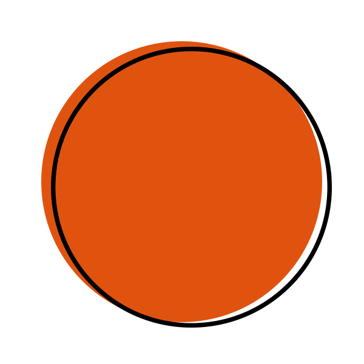

#  **João Matos' Personal Website**

This website was developed with the purpose of sharing my life pathway, throughout my academic experiences, research internships, students' associations I've been involved, and projects I developed in University.

The used technologies were HTML, CSS, and JavaScript. Google Analytics was set up for data usage tracking.

As for the next steps of this project, I'm planning to include a Portuguese version and to make my website responsive to smaller devices, such as mobile devices.

Please feel free to open any issue or to send me a message if you find any problem. Cheers!
